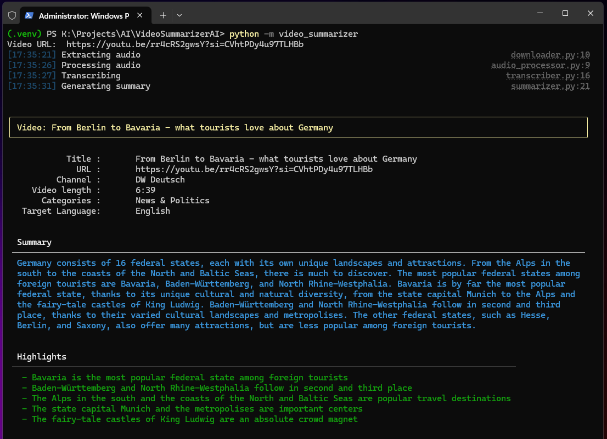
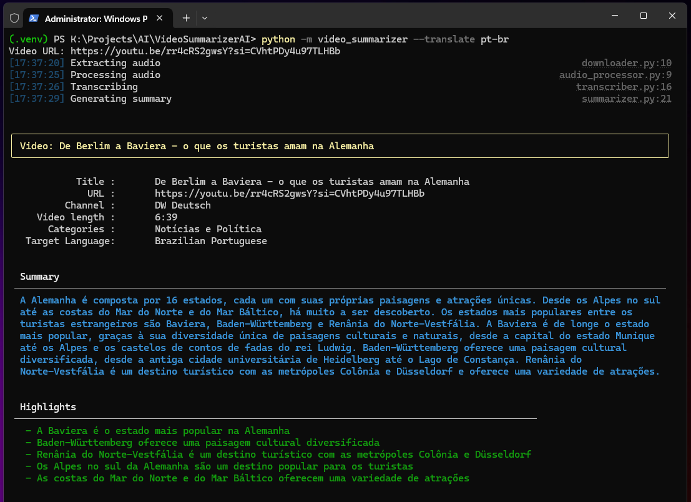
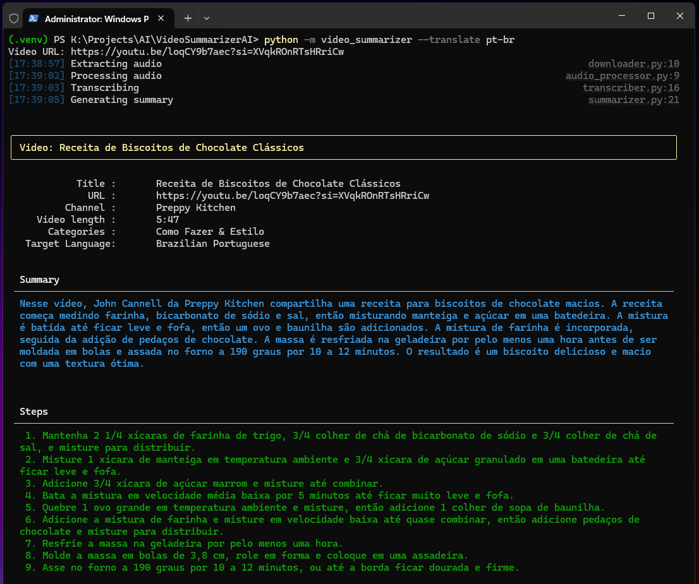

# YouTube Video Summarizer

**YouTube Video Summarizer** is a command-line tool developed to summarize YouTube videos, offering:
- **General Summary**: A concise synopsis of the video content.
- **Highlights**: The most important moments (when applicable).
- **Step-by-Step**: Organized instructions for videos like tutorials or recipes (when applicable).

The project was implemented in Python using **LangChain** and **Groq API** libraries, aiming to study the development of solutions based on Artificial Intelligence.
I took the opportunity to explore concepts like:
- **Python**: virtual env, packages, OOP, console interaction, environment variables, strong typing, file access (read and write), JSON manipulation, lists, general language features;
- **LangChain**: chaining, runnables, chat prompt templates, LLM integrations;

---

## Requirements

```
Python 3.10+
FFMPEG library
```

## Installation

Follow the steps below to set up the project in your local environment:

### 1. Clone this repository
```bash
git clone https://github.com/egehlen/youtube-video-summarizer.git
cd youtube-video-summarizer
```

### 2. Create and activate a virtual environment
#### Linux/MacOS
```bash
python3 -m venv .venv
source .venv/bin/activate
```

#### Windows (PowerShell)
```bash
python -m venv .venv
.venv\Scripts\Activate.ps1
```

#### Windows (Command Prompt)
```bash
python -m venv .venv
.venv\Scripts\activate.bat
```

### 3. Install dependencies
```bash
pip install -r requirements.txt
```

### 4. Install FFMPEG
This project requires FFmpeg for pre-processing the audio. Install it using the following instructions:

#### Linux (Debian-based)
```bash
sudo apt update
sudo apt install ffmpeg
```

#### MacOS (using Homebrew)
```bash
brew install ffmpeg
```

#### Windows
Download the FFmpeg binaries from FFmpeg.org, extract them, and add the bin directory to your system's PATH.

### 5. Setup a Groq API Key

1. Go to the [GroqCloud website](https://console.groq.com/).
2. Create an account or log in.
3. Navigate to the API Keys section and click on "Create API Key".
4. Choose a name, hit "Submit". Copy the generated key.
5. Copy the example environment file:
```bash
cp .env-example .env
```
6. Edit the `.env` file and replace "your_api_key_here" with your API key:
```env
GROQ_API_KEY=your_api_key_here
```

---

## How to Use

1. Ensure the virtual environment is activated.
2. Run the following command to start the summarizer:
```bash
python -m video_summarizer
```
3. Enter the YouTube video link when prompted.
4. To translate the summary into a supported language, use the `--translate` command-line argument, followed by the desired language:
   - **en** for English (default);
   - **pt-br** for Brazilian English;
```bash
python -m video_summarizer --translate <language>
```

---

## Screenshots

### News or informational content
Video: https://youtu.be/rr4cRS2gwsY?si=CVhtPDy4u97TLHBb

Although the original video language is German, I got the summary and highlights in English, as expected:



Then tested with translation to Brazilian Portuguese:



### Recipes or tutorials
Video: https://youtu.be/loqCY9b7aec?si=XVqkROnRTsHRriCw

Output with summary and steps:



---

## Limitations
- Long video content may encounter issues due to API rate limits. If that happens, check your [rate limits](https://console.groq.com/settings/limits) or wait a few minutes.
- Videos without speech or recognizable audio cannot be summarized.
- Audio with multiple simultaneous speakers may cause difficulties in generating summaries.
- Poor quality or unclear audio can compromise the accuracy of the summary.
